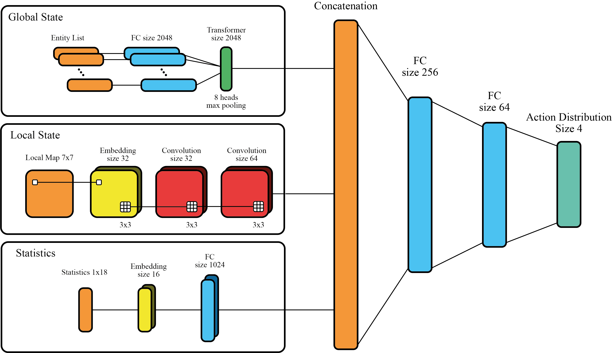
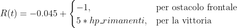

# RealTime Rogue

**RealTime Rogue** is a prototype _realtime_ game developed in Unity that uses third person action games mechanics mixed
with strategic and rpg elements. Game was design to provide a good challenge level, thanks to our NPCs trained with 
**Deep Reinforcement Learning** algorithms.

The project was part of a Master thesis in Computer Engineering at Università degli Studi di Firenze, with title 
"RealTime Rogue: Deep Reinforcement Learning for Believable NPC Behaviors in Action RPGs", made under the supervision of
[Alessandro Sestini](https://github.com/SestoAle). This game studies DRL problems in real time games after a previous 
work called [_DeepCrawl_](https://github.com/SestoAle/DeepCrawl) [1].

## Main features of this game:

- Player has to defeat his enemies in every room to reach the next level;
- Player can enhance its characteristics in some rest room;
- Player and NPCs have to collect items, like potions and power swords, to win the rooms;
- The game ends when the character dies, like other _Rogue Lite_ games.

## Goal

The core business of our thesis was to create NPCs with intelligent AI with DRL. In particolar our NPCs have to be:

- **credible** and they have to adopt clever strategies to defeat the player;
- **imperfect**, because we do not want _super-human_ opponents;
- **prior-free**, this means that the programmer do not design specific NPC behaviors, so agents must learn 
  independently the best strategy;
- **various**, in this game there are 2 different NPC classes (warrior and wizard) to get a good variety level.

## Deep Reinforcement Learning Model

The algorithm used in this project is Proximal Policy Optimization [2] (implemented in _TensorFlow_).

### Policy Network

### Reward Function

## References

[1] Alessandro Sestini, Alexander Kuhnle, and Andrew D. Bagdanov. _DeepCrawl: Deep reinforcement learning for turn-based 
strategy games_, 2020.

[2] John Schulman et al. _Proximal policy optimization algorithms_. CoRR, abs/1707.06347, 2017.
